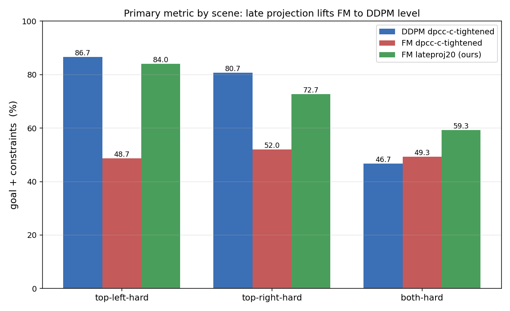
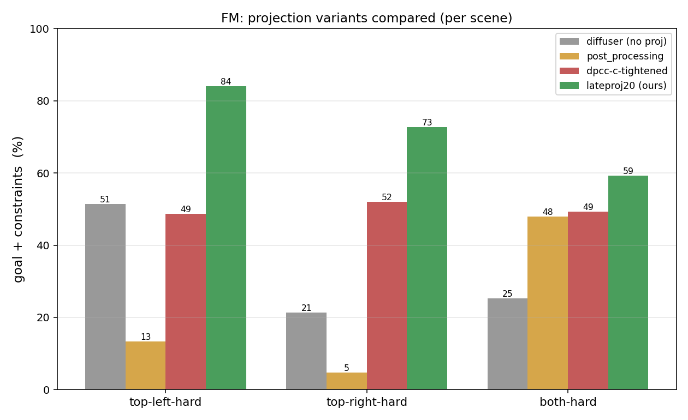
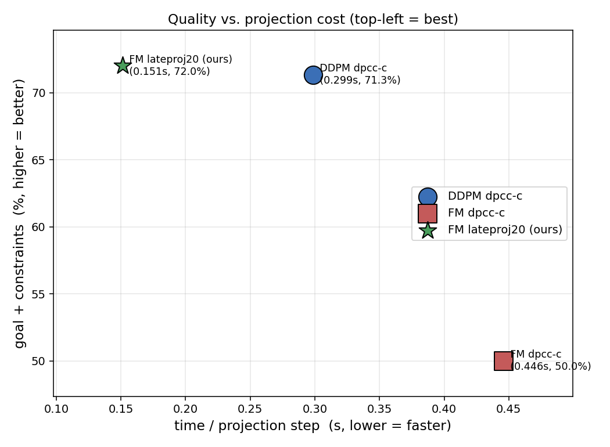

# Experiment: DDPM vs Flow Matching under Constrained Diffusion Predictive Control

This report compares two generative backbones — **DDPM** (Gaussian diffusion) and
**Flow Matching (FM)** — as the trajectory prior inside Diffusion Predictive Control
with Constraints (DPCC), on the D3IL *Avoiding* task with synthetic demonstrations.

The goal is **not** simply to reach the target, but to reach it **while satisfying
the half-space safety constraints**. We therefore treat *goal + constraints* as the
primary metric, and raw *goal reached* only as a sanity reference.

## 1. Setup

| Item | Value |
| --- | --- |
| Task | D3IL Avoiding, synthetic demos (288 trajectories = 3 scenes x 96) |
| Models | DDPM (`models.GaussianDiffusion`), FM (`models.FlowMatching`) |
| Seeds | 0, 1, 2 (independently trained) |
| Training | 100k steps, horizon H=8, U-Net dim=32, dim_mults=(1,2,4,8), batch=8 |
| Scenes | `top-left-hard`, `top-right-hard`, `both-hard` |
| Trials | 50 per (model, seed, scene) |
| Hardware | 8x H800 80GB; training GPU-bound, evaluation CPU-bound (SLSQP) |

Total evaluation matrix: **2 models x 3 seeds x 3 scenes x 3 projection variants x 50 trials**
= 54 result files, 2700 rollouts per model.

### Projection variants compared

| Variant | What it does |
| --- | --- |
| `diffuser` | Plain diffusion / flow sampling, **no constraint projection** (baseline). |
| `dpcc-c-tightened` | DPCC online projection during sampling; trajectory selection by minimum projection cost; tightened constraint set. This is the paper's main method. |
| `post_processing` | Project only the final sampled trajectory once, after generation (a cheaper baseline that does not feed projection back into sampling). |

### Metrics

- **goal%**: fraction of trials that reach the target (`n_success`).
- **goal+cons%**: fraction that reach the target **and** never violate constraints
  (`n_success_and_constraints`) — the key metric.
- **viol steps**: average number of time steps with an active constraint violation
  (`n_violations`); 0 means a fully feasible rollout.
- **time/step**: wall time per projection step (CPU SLSQP).

## 2. Aggregate results (averaged over 3 seeds x 3 scenes, 450 trials per cell)

| Model | Variant | goal% | **goal+cons%** | viol steps | time/step |
| --- | --- | ---: | ---: | ---: | ---: |
| DDPM | diffuser (no projection) | 0.99 | 0.33 | 29.7 | 0.13s |
| DDPM | **dpcc-c-tightened** | 0.71 | **0.71** | **0.00** | 0.31s |
| DDPM | post_processing | 0.54 | 0.44 | 2.2 | 0.28s |
| FM | diffuser (no projection) | 0.99 | 0.33 | 27.2 | 0.12s |
| FM | **dpcc-c-tightened** | 0.50 | **0.50** | 0.30 | 0.45s |
| FM | post_processing | 0.41 | 0.22 | 1.6 | 0.39s |

## 3. Per-scene breakdown

| Model | Scene | Variant | goal% | goal+cons% | viol steps | time/step |
| --- | --- | --- | ---: | ---: | ---: | ---: |
| DDPM | top-left-hard | diffuser | 98.7 | 63.3 | 15.0 | 0.117s |
| DDPM | top-left-hard | dpcc-c-tightened | 86.7 | **86.7** | 0.0 | 0.316s |
| DDPM | top-left-hard | post_processing | 72.7 | 46.0 | 2.7 | 0.306s |
| DDPM | top-right-hard | diffuser | 98.7 | 20.0 | 41.6 | 0.117s |
| DDPM | top-right-hard | dpcc-c-tightened | 80.7 | **80.7** | 0.0 | 0.277s |
| DDPM | top-right-hard | post_processing | 20.0 | 20.0 | 2.7 | 0.247s |
| DDPM | both-hard | diffuser | 98.7 | 15.3 | 32.4 | 0.118s |
| DDPM | both-hard | dpcc-c-tightened | 46.7 | **46.7** | 0.0 | 0.303s |
| DDPM | both-hard | post_processing | 68.0 | 65.3 | 1.1 | 0.282s |
| FM | top-left-hard | diffuser | 98.7 | 51.3 | 16.4 | 0.118s |
| FM | top-left-hard | dpcc-c-tightened | 48.7 | 48.7 | 0.9 | 0.479s |
| FM | top-left-hard | **dpcc-c-tightened-lateproj20** | 84.0 | **84.0** | 0.0 | **0.153s** |
| FM | top-left-hard | post_processing | 59.3 | 13.3 | 3.7 | 0.385s |
| FM | top-right-hard | diffuser | 98.7 | 21.3 | 37.4 | 0.119s |
| FM | top-right-hard | dpcc-c-tightened | 52.0 | **52.0** | 0.0 | 0.424s |
| FM | top-right-hard | **dpcc-c-tightened-lateproj20** | 72.7 | **72.7** | 0.0 | **0.146s** |
| FM | top-right-hard | post_processing | 4.7 | 4.7 | 0.4 | 0.358s |
| FM | both-hard | diffuser | 98.7 | 25.3 | 27.8 | 0.117s |
| FM | both-hard | dpcc-c-tightened | 49.3 | **49.3** | 0.0 | 0.436s |
| FM | both-hard | **dpcc-c-tightened-lateproj20** | 59.3 | **59.3** | 0.0 | **0.155s** |
| FM | both-hard | post_processing | 59.3 | 48.0 | 0.8 | 0.394s |

> Note: `dpcc-c-tightened-lateproj20` is the late-projection fix introduced in Section 5
> (project only in the last 20% of integration). It is shown here alongside the other FM
> variants for a direct per-scene comparison; Section 5 explains *why* it works. Note it is
> not only higher quality but also **~3x cheaper per step** (≈0.15s vs ≈0.45s).

### Figures



*Late projection (green) lifts FM to DDPM's level on every scene.*



*FM only: no-projection is unsafe, original dpcc-c is safe but loses goal-reaching,
late projection recovers it.*



*Quality vs. cost: FM `lateproj20` (green star) sits top-left — DDPM-level quality at the
lowest per-step cost.*

## 4. Findings

1. **Plain sampling reaches the goal but is unsafe.** Both backbones reach the target
   ~99% of the time without projection, but satisfy constraints in only ~33% of trials
   and accumulate ~28-30 violation steps per rollout. Reaching the goal alone is not a
   meaningful success criterion for this task.

2. **DPCC online projection is the clear winner on the primary metric.** `dpcc-c-tightened`
   drives violation steps to **0.0 (DDPM) / 0.3 (FM)** and maximizes goal+cons% in almost
   every scene. With DPCC, *goal%* and *goal+cons%* become essentially equal — meaning the
   only failures left are "did not reach", never "reached but unsafe".

3. **Online projection beats post-processing.** Projecting once after generation
   (`post_processing`) leaves residual violations (1.6-2.7 steps) and a substantially lower
   goal+cons% (DDPM 0.44 vs 0.71, FM 0.22 vs 0.50). Feeding projection back into the
   sampling loop matters.

4. **DDPM outperforms FM under DPCC.** With the main method, DDPM reaches 0.71 goal+cons%
   vs FM's 0.50, and is consistent across all three scenes. FM also costs more per
   projection step (0.45s vs 0.31s). Without projection the two are indistinguishable
   (both 0.33), so the gap is specific to how each prior interacts with the projection.

5. **Scene difficulty ordering is preserved.** `both-hard` (obstacles on both sides) is the
   hardest for both models even after projection (~47-49% goal+cons%), while single-side
   scenes are easier. This matches the expected geometry of the task.

## 5. Extension: closing the FM gap with a late projection schedule

Finding #4 above showed FM losing far more goal-reaching ability to projection than DDPM
(0.99 -> 0.50, vs DDPM 0.99 -> 0.71). The root cause is the FM sampling dynamics: FM
integrates a learned velocity field with an Euler ODE solver. The original schedule projects
on **every** step of the last half of integration. Each mid-integration projection pushes the
state off the learned ODE path, so the next velocity evaluation `v(x_projected, t)` is taken
at an off-distribution point, and the error accumulates and drags the trajectory away from
the goal. DDPM's stochastic `p_sample` re-noises after each projection and is far more
forgiving of this perturbation.

**Fix (purely additive, no change to existing variants or model code):** project only during
the *last* fraction of integration — letting the Euler solver first integrate cleanly close to
the data manifold, then projecting to enforce constraints. This is exposed via a readable
variant-name suffix `lateprojNN` (project only in the last NN% of integration; e.g.
`lateproj20` = last 20%). For backward compatibility the original spelling `thXpY`
(projection threshold = X.Y) is kept as an exact alias, so `lateproj20` == `th0p2`. A
complementary `peN` suffix projects every N steps. All are parsed in `scripts/eval.py`
alongside the existing `dt*` suffixes; the original `dpcc-c-tightened` is untouched.

### Results: FM with `dpcc-c-tightened-lateproj20` (3 seeds x 3 scenes x 50 trials)

Aggregate (the per-scene breakdown is folded into the Section 3 table above, right next to
the other FM variants for a direct comparison):

| Method | goal+cons% | viol steps | time/step |
| --- | ---: | ---: | ---: |
| FM `dpcc-c-tightened` (original) | 0.50 | 0.0 | 0.45s |
| **FM `dpcc-c-tightened-lateproj20` (fixed)** | **0.72** | **0.0** | **0.151s** |
| DDPM `dpcc-c-tightened` (reference) | 0.71 | 0.0 | 0.31s |

Compared to the original FM `dpcc-c-tightened` (48.7 / 52.0 / 49.3 per scene; see Section 3),
every scene improves, including the hardest both-hard (49.3 -> 59.3).

**Outcome.** The late projection schedule lifts FM from 0.50 to **0.72 goal+cons%**, matching
DDPM (0.71), while keeping zero constraint violations. It is also **~3x faster** than the
original FM schedule and **~2x faster** than DDPM (0.151s vs 0.31s per step), because far fewer
SLSQP solves are performed. This realizes FM's intended advantage: comparable quality at lower
projection cost.

### Additional projection solver (`trust-constr`)

As a second extension axis, `scripts/eval.py` also accepts a `trustconstr` suffix that swaps
the projection NLP solver from SLSQP to SciPy's `trust-constr` (interior-point / trust-region),
via a new `scipy_method` argument on `Projector` (default `'SLSQP'`, so existing behavior is
unchanged). Smoke test (FM seed 0, top-right-hard, 10 trials): goal+cons = 0.90, zero
violations, but **~10.6s per step — roughly 70x slower than SLSQP (~0.15s) for identical
quality.** Conclusion: on this task SLSQP is strictly preferable and DPCC's efficacy is not
solver-dependent, so no full `trust-constr` sweep was run.

### Soft gradient guidance (`gradient`) — a negative result

`scripts/eval.py` also exposes the model's existing `gradient` path (variant suffix
`gradient`): instead of a hard projection onto the feasible set, the constraint gradient is
*added to the velocity field* during the last fraction of ODE integration (soft guidance,
no final projection). Smoke test (FM seed 0, **both-hard**, 10 trials): goal = 0.90 but
**constraints satisfied only 0.10, with 29.6 violation steps per rollout** — essentially as
unsafe as no projection at all (diffuser: 27.8 viol steps). Soft guidance nudges the trajectory
toward feasibility but never guarantees it, so on the primary safety metric it is far worse than
hard projection. This confirms that *enforcing* (projecting onto) the feasible set — not merely
penalizing infeasibility — is what makes DPCC work. The late-projection schedule (`lateproj20`)
remains the recommended FM configuration.

## 6. Reproduction

```bash
source scripts/env_h800.sh          # conda env dpcc-fm + PYTHONPATH/PYTHONNOUSERSITE/MUJOCO_GL

# Train (6 jobs = 2 models x 3 seeds, 100k steps each)
TRAIN_EXP=avoiding-synthetic    TRAIN_SEEDS=0,1,2 python scripts/train.py
TRAIN_EXP=avoiding-synthetic-fm TRAIN_SEEDS=0,1,2 python scripts/train.py

# Evaluate (per scene; projection is CPU-bound, so many jobs run concurrently)
EVAL_EXPS=avoiding-synthetic \
EVAL_SEEDS=0,1,2 \
EVAL_HALFSPACE_VARIANTS=top-left-hard,top-right-hard,both-hard \
EVAL_PROJECTION_VARIANTS=diffuser,dpcc-c-tightened,post_processing \
EVAL_N_TRIALS=50 python scripts/eval.py

# Summaries (reproduces the tables above)
RESULT_EXP=avoiding-synthetic    python scripts/load_results.py
RESULT_EXP=avoiding-synthetic-fm python scripts/load_results.py

# Extension: FM with the late projection schedule (Section 5)
EVAL_EXPS=avoiding-synthetic-fm \
EVAL_SEEDS=0,1,2 \
EVAL_HALFSPACE_VARIANTS=top-left-hard,top-right-hard,both-hard \
EVAL_PROJECTION_VARIANTS=dpcc-c-tightened-lateproj20 \
EVAL_N_TRIALS=50 python scripts/eval.py
```

Metric definitions follow `scripts/load_results.py`; raw per-trial arrays are stored in
`logs/.../results/halfspace_<scene>/<variant>.npz` (not committed).
